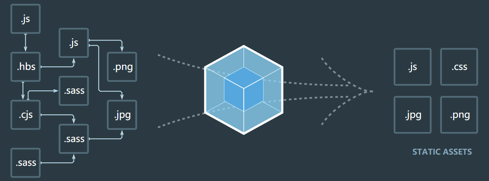
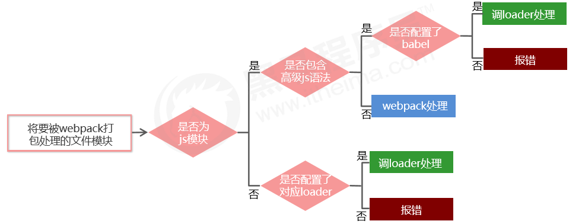

# webpack

## webpack 概述 

webpack 是一个流行的前端项目构建工具（打包工具），可以解决当前 web 开发中所面临的困境。

webpack 提供了友好的模块化支持，以及代码压缩混淆、处理 js 兼容问题、性能优化等强大的功能，从而让程序员把 工作的重心放到具体的功能实现上，提高了开发效率和项目的可维护性。

目前绝大多数企业中的前端项目，都是基于 webpack 进行打包构建的。 



## webpack 的基本使用

### 创建列表隔行变色项目

1. 新建项目空白目录，并运行 npm init -y 命令，初始化包管理配置文件 package.json
2. 新建 src 源代码目录
3. 新建 src -> index.html 首页 
4. 初始化首页基本的结构
5. 运行 npm install jquery 命令，安装 jQuery
6. 通过模块化的形式，实现列表隔行变色效果

示例代码如下：

```html
<!-- index.html -->

<!DOCTYPE html>
<html>
  <head>
    <script src="./index.js"></script>
  </head>
  <body>
    <ul>
      <li>这是第1个li</li>
      <li>这是第2个li</li>
      <li>这是第3个li</li>
      <li>这是第4个li</li>
      <li>这是第5个li</li>
      <li>这是第6个li</li>
      <li>这是第7个li</li>
      <li>这是第8个li</li>
      <li>这是第9个li</li>
    </ul>
  </body>
</html>
```

```javascript
// index.js

import $ from 'jquery'

$(function() {
  $('li:odd').css('backgroundColor', 'blue')
  $('li:even').css('backgroundColor', 'lightblue')
})
```

打开 index.html 会报一个错误，因为此时不支持 ES6 的模块导入语法：

```
Uncaught SyntaxError: Cannot use import statement outside a module
```

### 在项目中安装和配置 webpack

1. 运行 npm install webpack webpack-cli -D 命令，安装 webpack 相关的包
2. 在项目根目录中，创建名为 webpack.config.js 的 webpack 配置文件
3. 在 webpack 的配置文件中，初始化如下基本配置： 
```javascript
module.exports = {
  mode: 'development' // mode 用来指定构建模式 
}
```
4. 在 package.json 配置文件中的 scripts 节点下，新增 dev 脚本如下： 
```json
"scripts": {
  "dev": "webpack" // script 节点下的脚本，可以通过 npm run 执行 
}
```
5. 在终端中运行 npm run dev 命令，启动 webpack 进行项目打包。
6. 使用打包后的 main.js 文件，可获得列表隔行变色的效果。
```html
<!-- <script src="./index.js"></script> -->
<script src="../dist/main.js"></script>
```

### 配置打包的入口和出口

webpack 的 4.x 版本中默认约定：

- 打包的入口文件为 src  -> index.js 
- 打包的输出文件为 dist -> main.js

如果要修改打包的入口与出口，可以在 webpack.config.js 中新增如下配置信息： 

```javascript
const path = require('path')

module.exports = {
  entry: path.join(__dirname, './src/index.js'), // 打包入口文件的路径
  output: {
    path: path.join(__dirname, './dist'),        // 输出文件的存放路径
    filename: 'bundle.js'                        // 输出文件的名称
  }
}
```

修改 script 脚本的引用路径为 "../dist/bundle.js"，同样可获得列表隔行变色的效果。

### 配置 webpack 的自动打包功能

1. 运行 npm install webpack-dev-server -D 命令，安装支持项目自动打包的工具
2. 修改 package.json -> scripts 中的 dev 命令如下： 
```json
"scripts": {
  "dev": "webpack-dev-server" // script 节点下的脚本，可以通过 npm run 执行 
}
```
3. 将 src -> index.html 中，script 脚本的引用路径，修改为 "/buldle.js"
4. 运行 npm run dev 命令，重新进行打包
5. 在浏览器中访问 http://localhost:8080 地址，查看自动打包效果

**注意：**

- webpack-dev-server 会启动一个实时打包的 http 服务器 
- webpack-dev-server 打包生成的输出文件，默认放到了项目根目录中，而且是虚拟的、看不见的

### 配置 html-webpack-plugin 生成预览页面 

1. 运行 npm install html-webpack-plugin -D 命令，安装生成预览页面的插件
2. 修改 webpack.config.js 文件头部区域，添加如下配置信息： 
```javascript
// 导入生成预览页面的插件，得到一个构造函数 
const HtmlWebpackPlugin = require('html-webpack-plugin') 
// 创建插件的实例对象
const htmlPlugin = new HtmlWebpackPlugin({ 
  template: './src/index.html', // 指定要用到的模板文件   
  filename: 'index.html'        // 指定生成的文件的名称，该文件存在于内存中，在目录中不显示 
})
```
3. 修改 webpack.config.js 文件中向外暴露的配置对象，新增如下配置节点： 
```javascript
module.exports = {
  plugins: [ htmlPlugin ] // plugins 数组是 webpack 打包期间会用到的一些插件列表
}
```

### 配置自动打包相关的参数 

在 package.json 中进行配置：  

```javascript 
// --open 打包完成后自动打开浏览器页面   
// --host 配置 IP 地址   
// --port 配置端口   
"scripts": { 
  "dev": "webpack-dev-server --open --host 127.0.0.1 --port 8888" 
}, 
```

## webpack 中的加载器

### 通过 loader 打包非 js 模块 

在实际开发过程中，webpack 默认只能打包处理以 .js 后缀名结尾的模块，其他非 .js 后缀名结 尾的模块，webpack 默认处理不了，需要调用 loader 加载器才可以正常打包，否则会报错！

loader 加载器可以协助 webpack 打包处理特定的文件模块，比如： 

- less-loader 可以打包处理 .less 相关的文件
- sass-loader 可以打包处理 .scss 相关的文件 
- url-loader  可以打包处理 css 中与 url 路径相关的文件 

### loader 的调用过程



### 打包处理 css 文件 

1. 运行 npm i style-loader css-loader -D 命令，安装处理 css 文件的 loader 
2. webpack.config.js 的 module -> rules 数组中，添加 loader 规则如下： 
```javascript
// 所有第三方文件模块的匹配规则   
module: { 
  rules: [ 
    { test: /\.css$/, use: ['style-loader', 'css-loader'] } 
  ] 
} 
```
其中，test 表示匹配的文件类型， use 表示对应要调用的 loader</br>
**注意：**
    - use 数组中指定的 loader 顺序是固定的
    - 多个 loader 的调用顺序是：从后往前调用
3. 在 src 目录下新建 css-> 1.css 文件，内容如下：
```css
li {
  list-style: none;
}
```
4. 在 index.js 中导入 css 文件，查看打包效果。
```javascript
import $ from 'jquery'
import './css/1.css'
```
### 打包处理 less 文件

1. 运行 npm i less-loader less -D 命令
2. 在 webpack.config.js 的 module -> rules 数组中，添加 loader 规则如下：
```javascript
{ test: /\.less$/, use: ['style-loader', 'css-loader', 'less-loader'] }
```
3. 在 src 目录下新建 css-> 1.less 文件，内容如下：
```less
body {
  margin: 0;
  padding: 0;
  ul {
    padding: 0;
    margin: 0;
  }
}
```
4. 在 index.js 中导入 less 文件，查看打包效果。
```javascript
import $ from 'jquery'
import './css/1.css'
import './css/1.less'
```

### 打包处理 scss 文件

1. 运行 npm i sass-loader node-sass -D 命令
2. 在 webpack.config.js 的 module -> rules 数组中，添加 loader 规则如下：
```javascript
{ test: /\.scss$/, use: ['style-loader', 'css-loader', 'sass-loader'] } 
```
3. 在 src 目录下新建 css-> 1.scss 文件，内容如下：
```scss
ul {
  font-size: 12px;
  li {
    line-height: 30px;
  }
}
```
4. 在 index.js 中导入 scss 文件，查看打包效果。
```javascript
import $ from 'jquery'
import './css/1.css'
import './css/1.less'
import './css/1.scss'
```

### 配置 postCSS 添加浏览器兼容性前缀

1. 运行 npm i postcss-loader autoprefixer -D 命令
2. 在项目根目录中创建 postcss 的配置文件 postcss.config.js，并初始化如下配置：
```javascript
const autoprefixer = require('autoprefixer') // 导入自动添加前缀的插件 
module.exports = {
  plugins: [ autoprefixer ] // 挂载插件
} 
```
3. 在 webpack.config.js 的 module -> rules 数组中，修改 css 的 loader 规则如下： 
```javascript
{ test:/\.css$/, use: ['style-loader', 'css-loader', 'postcss-loader'] } 
```

### 打包样式表中的图片和字体文件 

1. 运行 npm i url-loader file-loader -D 命令
2. 在 webpack.config.js 的 module -> rules 数组中，添加 loader 规则如下： 
```javascript
{ test: /\.jpg|png|gif|bmp|ttf|eot|svg|woff|woff2$/, use: 'url-loader?limit=16941' },
```
其中 ? 之后的是 loader 的参数项。limit 用来指定图片的大小，单位是字节(byte)，只有小于 limit 大小的图片，才会被转为 base64 图片。

### 打包处理 js 文件中的高级语法 

1. 安装babel转换器相关的包：npm i babel-loader @babel/core @babel/runtime -D 
2. 安装babel语法插件相关的包：npm i @babel/preset-env @babel/plugin-transform-runtime  @babel/plugin-proposal-class-properties -D 
3. 在项目根目录中，创建 babel 配置文件 babel.config.js 并初始化基本配置如下： 
```javascript
module.exports = { 
  presets: [ '@babel/preset-env' ], 
  plugins: [ '@babel/plugin-transform-runtime', '@babel/plugin-proposal-class-properties' ] 
}
```
4. 在 webpack.config.js 的 module -> rules 数组中，添加 loader 规则如下： 
```javascript
// exclude 为排除项，表示 babel-loader 不需要处理 node_modules 中的 js 文件
{ test: /\.js$/, use: 'babel-loader', exclude: /node_modules/ } 
```

### 配置 Vue 组件的加载器

1. 运行 npm i vue-loader vue-template-compiler -D 命令
2. 在 webpack.config.js 配置文件中，添加 vue-loader 的配置项如下：
```javascript
const VueLoaderPlugin = require('vue-loader/lib/plugin') 
module.exports = { 
  module: { 
    rules: [       
      // ... 其它规则       
      { test: /\.vue$/, loader: 'vue-loader' } 
    ] 
  }, 
  plugins: [     
    // ... 其它插件     
    new VueLoaderPlugin() // 请确保引入这个插件！   
  ] 
}
```

### 在 webpack 项目中使用 Vue 

1. 运行 npm i vue –S 安装 vue 
2. 在 src -> index.js 入口文件中，通过 import Vue from 'vue' 来导入 vue 构造函数 
3. 创建 vue 的实例对象，并指定要控制的 el 区域 
4. 通过 render 函数渲染 App 根组件 
```javascript
// 1. 导入 Vue 构造函数 
import Vue from 'vue' 
// 2. 导入 App 根组件 
import App from './components/App.vue' 
 
const vm = new Vue({   
  // 3. 指定 vm 实例要控制的页面区域   
  el: '#app',   
  // 4. 通过 render 函数，把指定的组件渲染到 el 区域中   
  render: h => h(App) 
});
```

## webpack 打包发布

上线之前需要通过 webpack 将应用进行整体打包，可以通过 package.json 文件配置打包命令：

```javascript
// 该命令默认加载项目根目录中的 webpack.config.js 配置文件 
"scripts": {      
  // 用于打包的命令      
  "build": "webpack -p",      
  // 用于开发调试的命令      
  "dev": "webpack-dev-server --open --host 127.0.0.1 --port 3000", 
}, 
```

## 代码地址

[node-babel](https://github.com/zhzl/web-demo/tree/master/webpack-study)

## 更多

[webpack 中文文档](https://www.webpackjs.com/concepts/)